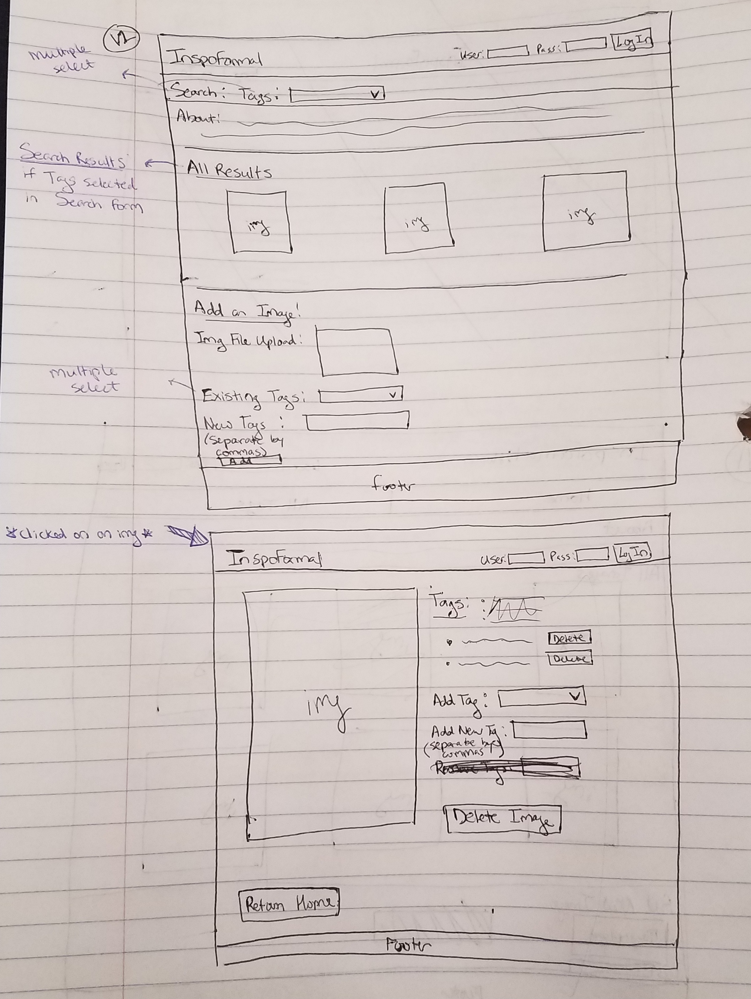

# Project 3: Design Journey

Your Name: Theresa Cho

**All images must be visible in Markdown Preview. No credit will be provided for images in your repository that are not properly linked in Markdown. Assume all file paths are case sensitive!**


# Project 3, Milestone 1 - Design, Plan, & Draft Website

## Describe your Gallery

[What will your gallery be about? 1 sentence.]
My gallery will be about fashion, makeup, venue, and decorations for mainly two formal events: Proms and Weddings.

## Target Audiences

[Tell us about your target two audiences. ~1-3 sentences per audience]
Persona 1: Alex
- High school senior who is very excited about prom
- Trendy & Fashionista --> wants to know what the trendiest dress to wear would be, fashion inspiration
- Is mainly concerned with fashion and makeup for prom
- Appreciates good aesthetics

Persona 2: Betty
- Recently engaged and preparing for the wedding
- Wants ideas about fashion, makeup, venue, and decorations for the formal occassion
- May/may not be working with a wedding planner
- Crafty, DIY person who wants to have their touch in every aspect of their wedding planning
- Loves to share any wedding ideas with other people who are preparing for their wedding

## Design Process

[Document your design process. Show us the evolution of your design from your first idea (sketch) to design you wish to implement (sketch). Show us the process you used to organize content and plan the navigation (e.g. card sorting).]

[Label all images. All labels must be visible in Markdown Preview.]
Note about card sorting: I did not really need cardsorting since most of my content would be on 1 page.

Sketch version 1 - Initially, I thought of creating a separate page that would list all the tags (similar to a directory):


Sketch version 2 - But I thought that having a separate "All Tags" page would be inconvenient for both my target audiences who may want to look at corresponding images for multiple tags at once. Therefore, I decided to have a very simple search form where the user could multiple select tags and the images would change accordingly; this eliminated the need for the second page. I also added to my "Add Image" section where the user could add new tags to the image they are uploading. Furthermore, in order to allow the user to see all the tags/edit the tags of a specific image, I decided to create a separate page with just the image they selected in the gallery.



## Final Design Plan

[Include sketches of your final design here.]
My sketch version 2 is my final design.


## Templates

[Identify the templates you will use on your site.]
I will use a template for my header and my footer.

## Database Schema Design

[Describe the structure of your database. You may use words or a picture. A bulleted list is probably the simplest way to do this. Make sure you include constraints for each field.]

[Hint: You probably need `users`, `images`, `tags`, and `image_tags` tables.]

[Hint: For foreign keys, use the singular name of the table + _id. For example: 1) `user_id` in the `images` table or 2) `image_id` and `tag_id` for the `image_tags` table.]

Table: users
* id: type - INTEGER, constraints - PK, U, Not, AI
* username: type - TEXT, constraints - U, Not
* password: type - TEXT, constraints - Not

Table: sessions
* id: type - INTEGER, constraints - PK, U, Not, AI
* user_id: type - INTEGER, constraints - Not
* session: type - TEXT, constraints - U, Not

Table: images
* id: type - INTEGER, constraints - PK, U, Not, AI
* citation: type - TEXT, constraints - Not
* user_id: type - INTEGER, constraints - Not

Table: tags
* id: type - INTEGER, constraints - PK, U, Not, AI
* tag: type - TEXT, constraints - U, Not

Table: image_tags
* id: type - INTEGER, constraints - PK, U, Not, AI
* image_id: type - INTEGER, constraints - Not
* tag_id: type - INTEGER, constraints - Not


## Code Planning

[Plan what top level PHP pages you'll need.]
index.php, image.php

[Plan what templates you'll need.]
Templates for header and footer.

[Plan any PHP code you'll need.]

Checking if user is logged in
  - If user logged in
    - Create session and store in database
    - Send uniquely created session ID as session cookie to user
    - User may upload image to gallery
    - If user's id matches user_id of image:
      - May delete that image
      - May delete tags from that image
    - If user logs out
      - Destroy session in database
      - Reset session cookie
  - Else:
    - May tag images
    - May view images

Search form
- If no search:
  - Show all images
- If search:
  - Show only images with those tags

Add new tag in add new image form or to pre-existing image:
- Separate new tag field by commas into an array
- Strip each element of array of whitespace
- Check if each tag already exists in list of tags
  - If new tag does not already exist:
    - Add tag to list of tags
    - Add tag to image
  - Else:
    - Echo that tag already exists

User-def function to render images with query string parameters from a list of image ids.


## Database Query Plan

[Plan your database queries. You may use natural language, pseudocode, or SQL.]

1. Users should be able to view all images in your photo gallery at once.

```sql
    SELECT images.id FROM images;
```
2. Users should be able to view all images for a tag at once.
```sql
    SELECT images.id FROM images INNER JOIN image_tags on images.id = image_tags.image_id INNER JOIN tags on tags.id = image_tags.tag_id WHERE tags.tag = "<tag input>";
```
3. Users should be able to view a single image and all the tags for that image at once.
```sql
    SELECT images.id, tags.tag FROM images INNER JOIN image_tags on images.id = image_tags.image_id INNER JOIN tags on tags.id = image_tags.tag_id WHERE images.id = "<image id>";
```
4. Users should be able to upload a new image.
```sql
INSERT INTO images (id,user_id)
VALUES (<id>, <user_id>);
```
If new tags
```sql
INSERT INTO tags (id,tag)
VALUES (<id>, "<tag input");
```

- Update image_tags table

5. Users should be able to remove (delete) an image.
Make sure you clean up any relationships to the image in other tables. (Where the image is a foreign key.)
Make sure you delete the corresponding file upload from disk.

- Remove image from images
- Update image_tags table

6. Users should be able to view all tags at once.
```sql
SELECT tags.tag FROM tags;
```

7. Users should be able to add an existing tag to an image
- Update image_tags


8. Add a new tag to an image
- Add new tag to tags
- Update image_tags

9. Remove a tag from an image.
- Update image_tags

# Project 3, Milestone 2 - Gallery and User Access Controls

## Issues & Challenges

[Tell us about any issues or challenges you faced while trying to complete milestone 2. 2-4 sentences/bullet points]


# Final Submission: Complete & Polished Website

## Reflection

[Take this time to reflect on what you learned during this assignment. How have you improved since starting this class? 2-4 sentences]


<footer>
<div class="footerSect">
  <p id="email">Contact Us: tsc82@cornell.edu</p>
</div>
</footer>

    <form id="searchForm" action="index.php" method="get">
      <fieldset>
      <legend>Search For or Filter Films</legend>
      <label for="movie_name_searchField">Movie Name: </label><input id="movie_name_searchField" type="text" name="movie_name_searchField"/>
      &#9679;
      <label for="genre_searchField">Genre: </label><input id ="genre_searchField" type="text" name="genre_searchField"/>
      &#9679;
      <label for="length_searchField">Movie Length: </label>
      <input id="length_searchField" type="number" name="length_searchField" min = "0"> minutes
      &#9679;
      <label for="rating_searchField">MPAA Rating (i.e. G, PG, PG-13): </label><input id="rating_searchField" type="text" name="rating_searchField"/>
      <button type="submit">Search</button>
      </fieldset>
    </form>


      <form id="uploadFile" action="box.php" method="post" enctype="multipart/form-data">
        <ul>
          <li>
            <!-- MAX_FILE_SIZE must precede the file input field -->
            <input type="hidden" name="MAX_FILE_SIZE" value="<?php echo MAX_FILE_SIZE; ?>" />

            <label for="box_file">Upload File:</label>
            <input id="box_file" type="file" name="box_file">
          </li>
          <li>
            <label for="box_desc">Description:</label>
            <textarea id="box_desc" name="description" cols="40" rows="5"></textarea>
          </li>
          <li>
            <button name="submit_upload" type="submit">Upload File</button>
          </li>
        </ul>
      </form>
